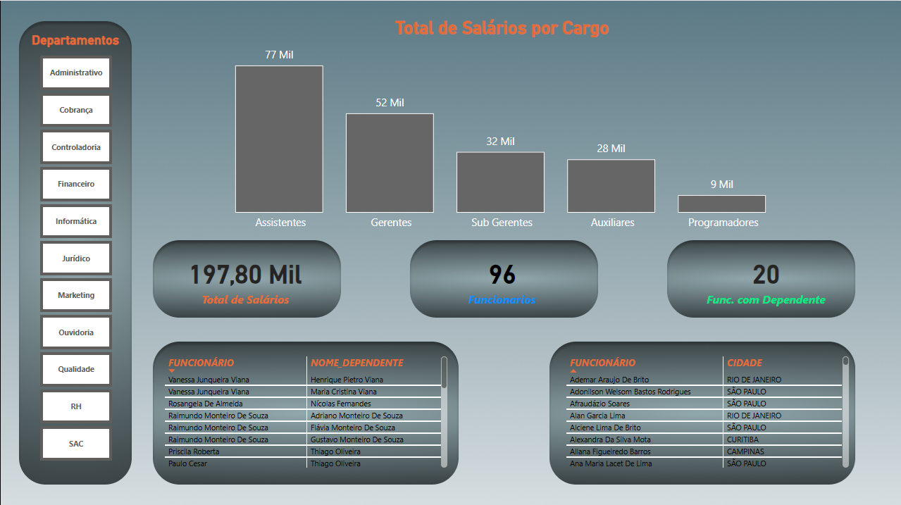

# 📊 Dashboard de Análise de RH e Folha Salarial

Este projeto apresenta uma análise detalhada dos custos com pessoal e do perfil dos funcionários de uma organização. O objetivo é facilitar a visualização de KPIs críticos para a gestão de RH.

## 🖼️ Visualização do Painel

---

## 🛠️ Ferramentas e Processos
* **Excel (CSV)**: Utilizado como fonte de dados.
* **Power BI**: 
    * Limpeza e tratamento de dados com **Power Query**.
    * Criação de medidas e indicadores com a linguagem **DAX**.
    * Design de interface focado em experiência do usuário (UX).

## 📈 Principais Insights
Com base no dashboard, podemos observar:
* **Concentração Salarial**: O cargo de "Assistentes" possui o maior montante de salários acumulado (77 Mil).
* **Indicador de Dependentes**: Identificamos que 20 funcionários possuem dependentes, dado crucial para planejamento de benefícios.
* **Distribuição Geográfica**: O painel permite visualizar rapidamente a alocação de funcionários por cidades como Rio de Janeiro, São Paulo e Curitiba.

---

## ⚙️ Versionamento e Estrutura do Projeto
Diferente do padrão comum de salvar apenas um arquivo `.pbix`, este repositório utiliza o formato **Power BI Project (.PBIP)**.

### Por que isso é importante?
* **Granularidade**: O projeto é decomposto em arquivos de texto (JSON e metadados), permitindo que o GitHub rastreie alterações específicas em cada medida DAX ou visual.
* **Code Review**: Facilita a revisão de código, permitindo ver exatamente o que mudou entre uma versão e outra.
* **Segurança e Colaboração**: Garante que o histórico de desenvolvimento esteja salvo de forma estruturada, facilitando o trabalho em equipe e a manutenção a longo prazo.

---

## 🚀 Como visualizar o projeto localmente

1. **Clone o repositório:**
   Utilize o comando `git clone` seguido da URL do repositório ou use a opção "Open with GitHub Desktop" diretamente no site.

2. **Habilite o Formato de Projeto:**
   No Power BI Desktop, acesse **Arquivo > Opções e Configurações > Opções > Recursos de Pré-visualização** e ative a opção **"Projeto do Power BI (.pbip)"**.

3. **Abra o arquivo:**
   Localize e execute o arquivo chamado **analise_rh.pbip** na pasta raiz do projeto.

4. **Atualize a Fonte de Dados:**
   Caso os gráficos não carreguem devido ao caminho do arquivo original:
   * Vá em **Página Inicial > Transformar Dados > Configurações da Fonte de Dados**.
   * Clique em **Alterar Fonte** e selecione o arquivo CSV localizado na pasta que você clonou.
   * Se houver erro de "Chave", clique em **Transformar Dados**, vá na etapa **Navegação** (painel direito) e aponte novamente para o arquivo.
   * Clique em **Fechar e Aplicar** para atualizar o painel.
